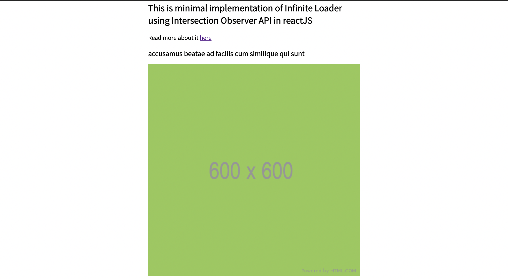

# react-infinite-loader

React infinite loader component using Intersection Observer API in react JS.

[ScrollLoader](./src/components/ScrollLoader/index.js) component can be re-used at any react page to add infinite loader functionality. It accepts 3 props

[Read blog article here](https://gulamhussain.dev/react-scroll-loader-component)

```js
<ScrollLoader
    isLoading={false}
    hasMoreData={false}
    onLoad = {this.getData}
>
```

| prop        | required | Description                                                                                                                  | type     |
| ----------- | -------- | ---------------------------------------------------------------------------------------------------------------------------- | -------- |
| isLoading   | yes      | Whether data fetching is in progress                                                                                         | boolean  |
| hasMoreData | yes      | Is there more data available to fetch, if yes then onLoad event will fire when user scrolls to the end of the page           | boolean  |
| onLoad      | yes      | a function, this will be executed when user scrolls to the end of the page and there is more data is available to be fetched | function |
| containerEl | no       | `HTMLElement` viewport (Default value is `null` it means browser viewport)                                                   |

[View demo](https://reverent-euler-e89f82.netlify.app/)


